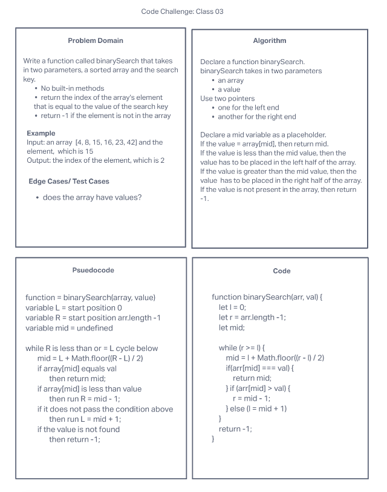

# Binary Search of Sorted array

Write a function called BinarySearch that takes in two parameters, a sorted array and the search key.

## Whiteboard Process

## Approch and Efficiency

First, I searched the definition of binary search and found some examples. I was able to understand how it works through the visualization, and I thought about using the left and right boundaries. I struggled a lot with the code, but after spending some time on it, I was able to figure out the code that works properly.
