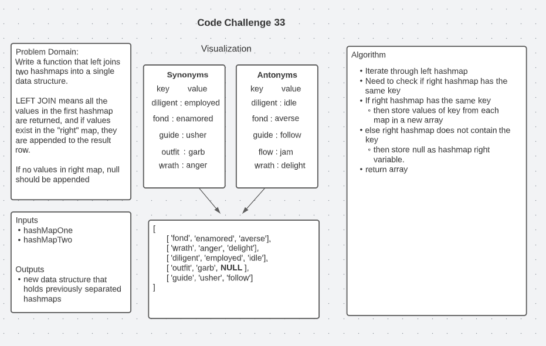

# Code Challenge 401

## Class 30: Hash Table Implementation

* Implement a Hashtable Class with the following methods:
  * set
    * Arguments: key, value
    * Returns: nothing
    * This method should hash the key, and set the key and value pair in the table, handling collisions as needed.
    * Should a given key already exist, replace its value from the value argument given to this method.
  * get
    * Arguments: key
    * Returns: Value associated with that key in the table
  * contains
    * Arguments: key
    * Returns: Boolean, indicating if the key exists in the table already.
  * keys
    * Returns: Collection of keys
  * hash
    * Arguments: key
    * Returns: Index in the collection for that key
    
## Class 31: Hashmap Repeated Word

* Write a function called repeated word that finds the first word to occur more than once in a string
  * Arguments: string
  * Return: string

## Class 33: Hashmap Left Join

* Write a function that LEFT JOINs two hashmaps into a single data structure.
  * Write a function called left join
  * Arguments: two hash maps
    * The first parameter is a hashmap that has word strings as keys, and a synonym of the key as values.
    * The second parameter is a hashmap that has word strings as keys, and antonyms of the key as values.
  * Return: The returned data structure that holds the results is up to you. It doesn’t need to exactly match the output below, so long as it achieves the LEFT JOIN logic

