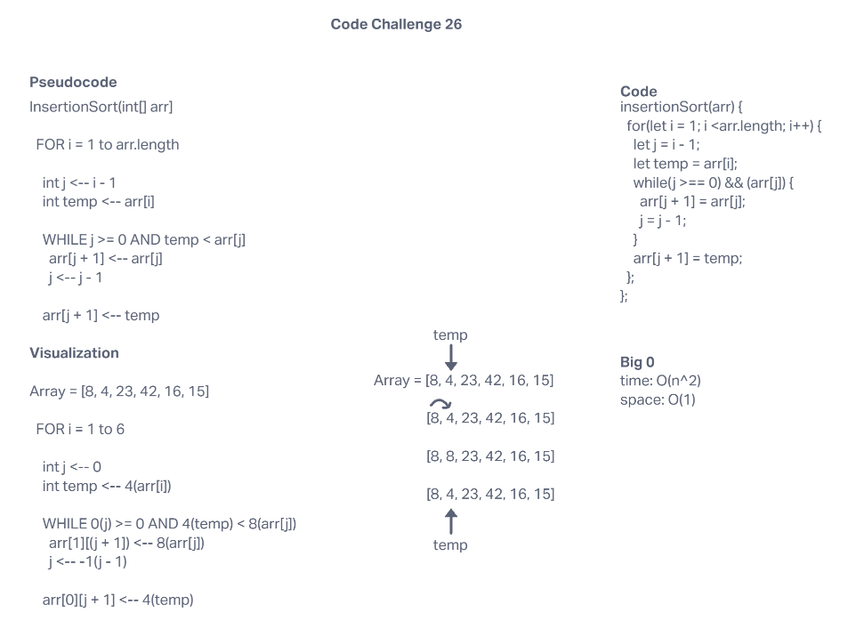

# Code Challenge 26

## Author: Simon Simon

## Table of Contents

* Assignment
* Pseudocode
* Whiteboard
* Link to code

## Assignment

Review the pseudocode below, then trace the algorithm by stepping through the process with the provided sample array. Document your explanation by creating a blog article that shows the step-by-step output after each iteration through some sort of visual.

Once you are done with your article, code a working, tested implementation of Insertion Sort based on the pseudocode provided.

### Pseudocode

```
  InsertionSort(int[] arr)

    FOR i = 1 to arr.length

      int j <-- i - 1
      int temp <-- arr[i]

      WHILE j >= 0 AND temp < arr[j]
        arr[j + 1] <-- arr[j]
        j <-- j - 1

      arr[j + 1] <-- temp
```

### Whiteboard



### Link to Code

[Code Challenge 26](https://github.com/sson68x/data-structures-and-algorithms/blob/main/javascript/code-401/sorting/insertion-sort/index.js)
